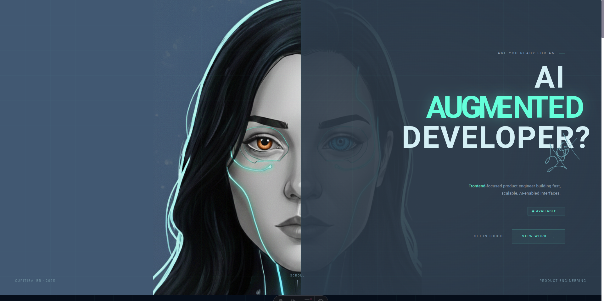

<div align="center">

# JOSM — Developer Portfolio

A cyberpunk-inspired developer portfolio with glitch effects, interactive animations, and a dark neon aesthetic. Built with Astro for zero-JS overhead and lightning-fast performance.

**[Live Site](#)** · **[Download Resume](public/assets/RESUME%20-%20JHÉSSINY%20MATTOS.pdf)**

</div>

---

## Preview

<div align="center">



</div>

## Tech Stack

| Layer | Tech |
|-------|------|
| **Framework** | [Astro 5](https://astro.build/) — static site generation, zero client JS by default |
| **Styling** | [Tailwind CSS 3](https://tailwindcss.com/) — utility-first with custom theme |
| **Language** | TypeScript + Vanilla JS for interactions |
| **Fonts** | Bebas Neue · Roboto · IBM Plex Mono |
| **Tooling** | pnpm · ESLint · Prettier |

## Features

- **Glitch & Neon Aesthetic** — RGB channel splits, horizontal slice animations, scanline overlays, and a `#64ffda` cyan accent throughout
- **Interactive Hero** — expandable avatar overlay, scramble/decrypt text animation, status tag scanning sequence
- **CRT Monitor Carousel** — project showcase inside a desktop monitor frame with OS chrome, glitch transitions, and swipe support
- **Animated Timeline** — work experience with glowing dots, connecting lines, and hover-triggered animations
- **Case Study Cards** — hover-activated scanlines and corner bracket reveals with accent color indicators
- **Skills Section** — color-coded tech pills by category (Frontend, Testing, Backend, AI/LLM) with animated language proficiency bars
- **Fully Responsive** — mobile-first design with touch-optimized interactions and a full-screen mobile menu
- **Agent-Readable** — machine-readable JSON (`/api/me`) and Markdown (`/api/me/markdown`) endpoints for AI agents, with `llms.txt` discovery, content negotiation middleware, and CORS support

## Getting Started

```bash
# Install dependencies
pnpm install

# Start dev server at localhost:4321
pnpm dev

# Build for production
pnpm build

# Preview production build
pnpm preview

# Lint & format
pnpm lint
pnpm format
```

## Project Structure

```
src/
├── layouts/
│   └── Layout.astro              # HTML shell, meta tags, fonts
├── pages/
│   ├── index.astro               # Main portfolio (all sections)
│   ├── api/
│   │   ├── me.ts                 # JSON endpoint (?filter= support)
│   │   └── me/
│   │       └── markdown.ts       # Markdown endpoint
│   └── case-study/               # Individual case study pages
│       ├── collamap.astro
│       └── study-map.astro
├── components/                   # Reusable UI
│   ├── Header.astro              # Sticky nav with scroll detection
│   ├── DefaultMenu.astro         # Desktop navigation
│   ├── MobileMenu.astro          # Full-screen mobile overlay
│   ├── Footer.astro              # Social links + JOSM watermark
│   ├── Container.astro           # Max-width wrapper
│   ├── Divider.astro             # Section divider
│   ├── NavItem.astro             # Navigation link
│   ├── Card.astro                # Card wrapper
│   └── BaseIcon.astro            # Icon with hover color effect
├── sections/                     # Page sections
│   ├── Introduction.astro        # Hero with avatar + animated text
│   ├── CaseStudies.astro         # Featured project cards
│   ├── WorkExperience.astro      # Timeline layout
│   ├── ExperienceItem.astro      # Individual job entry
│   ├── Projects.astro            # Monitor-frame carousel wrapper
│   ├── Carousel.astro            # Desktop carousel (JS)
│   ├── MobileCarousel.astro      # Mobile scroll-snap (CSS)
│   ├── ProjectItem.astro         # Project card
│   └── SkillsAndResume.astro     # Tech pills + language bars
├── lib/
│   └── portfolio-data.ts         # Centralized typed portfolio data
├── data/                         # Content (edit these to update)
│   ├── projects.ts               # Project entries
│   └── experiences.ts            # Work experience entries
├── types/
│   └── project.ts                # TypeScript interfaces
├── middleware.ts                  # Accept header content negotiation
└── styles/
    ├── global.css                # Tailwind directives + scrollbar
    └── resume-particles.css      # Particle animation keyframes

public/
├── assets/                       # Images, resume PDF, signature
├── llms.txt                      # LLM/agent discovery file
└── favicon.svg
```

## Updating Content

Edit the data files in `src/data/` — no need to touch component code:

- **Projects** — `src/data/projects.ts`
- **Work Experience** — `src/data/experiences.ts`

## Agent-Readable API

This portfolio exposes machine-readable endpoints so AI agents can discover and consume portfolio data without scraping HTML.

| Route | Content-Type | Description |
|-------|-------------|-------------|
| `/api/me` | `application/json` | Full portfolio as structured JSON |
| `/api/me?filter=skills,projects` | `application/json` | Filtered subsets (`skills`, `projects`, `experience`, `references`, `contact`, `case_studies`, `languages`) |
| `/api/me/markdown` | `text/markdown` | Portfolio formatted as clean Markdown for LLM context windows |
| `/llms.txt` | `text/plain` | Discovery file with identity, endpoints, and usage instructions |

**Content negotiation** — requests to `/` with `Accept: application/json` redirect to `/api/me`; `Accept: text/markdown` redirects to `/api/me/markdown`. Normal browser traffic is unaffected.

```bash
# JSON
curl https://portfolio-nu-seven-lv4odav0is.vercel.app/api/me

# Filtered
curl https://portfolio-nu-seven-lv4odav0is.vercel.app/api/me?filter=skills,experience

# Markdown
curl https://portfolio-nu-seven-lv4odav0is.vercel.app/api/me/markdown

# Content negotiation
curl -H "Accept: application/json" https://portfolio-nu-seven-lv4odav0is.vercel.app/
```

## Deployment

Configured for [Vercel](https://vercel.com/) with server-side rendering (`output: 'server'`) for API routes and middleware.

```bash
pnpm build
```

---

<div align="center">
  <sub>Built with Astro + Tailwind CSS</sub>
</div>
